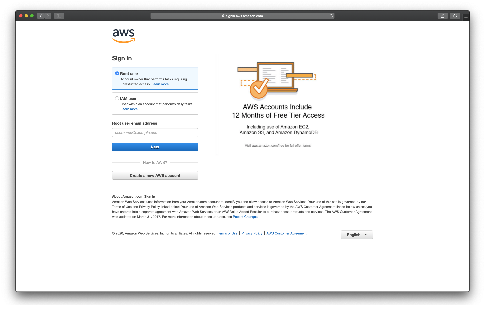
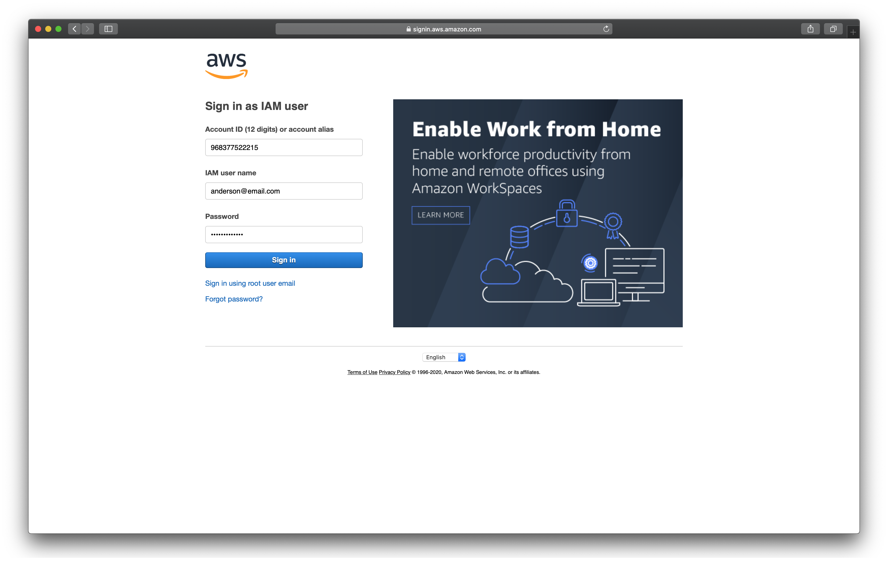
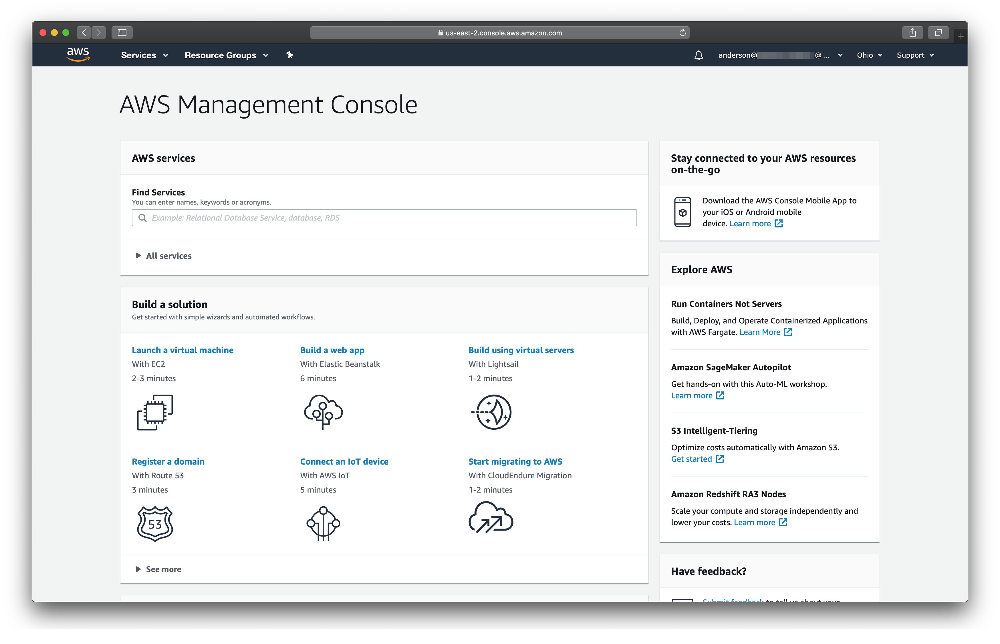
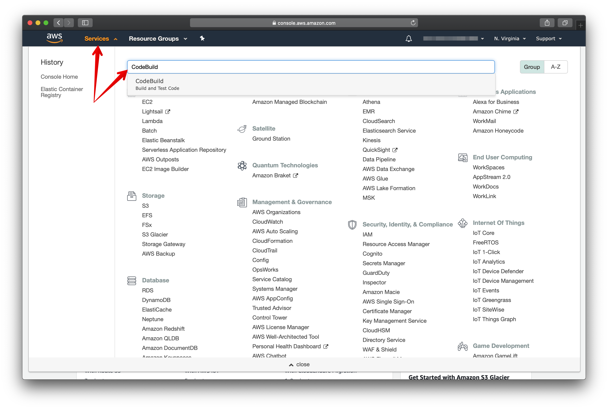
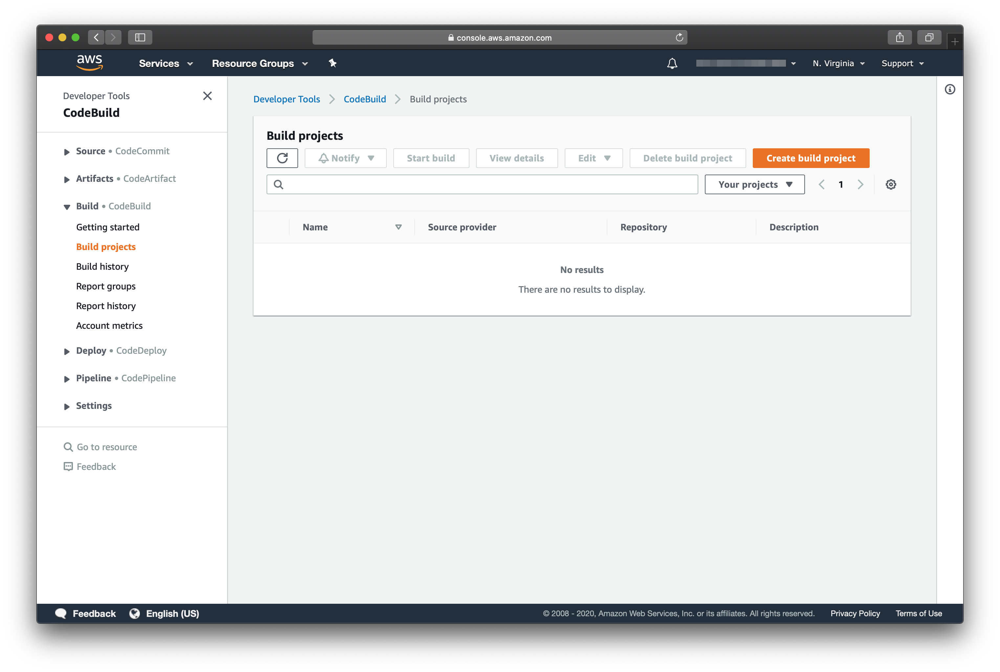
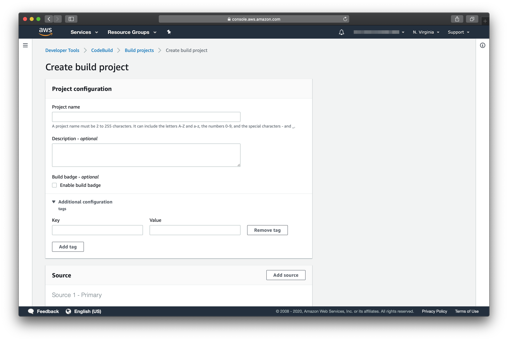
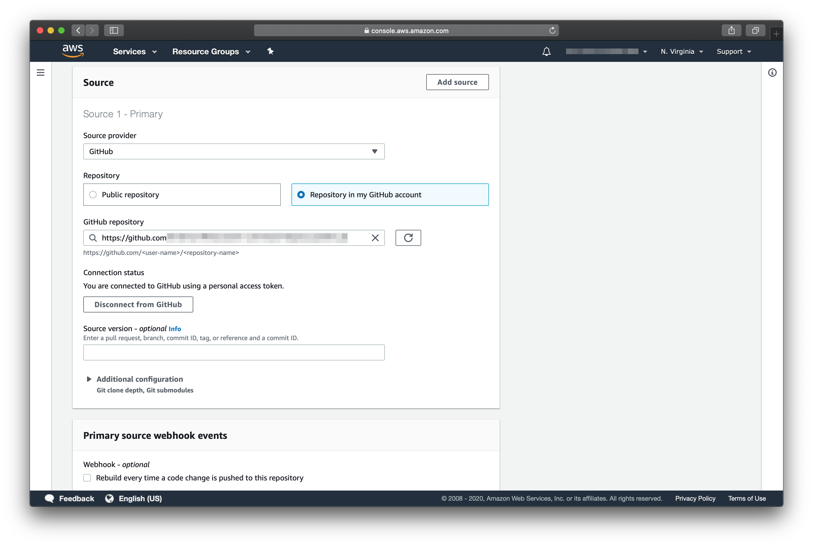
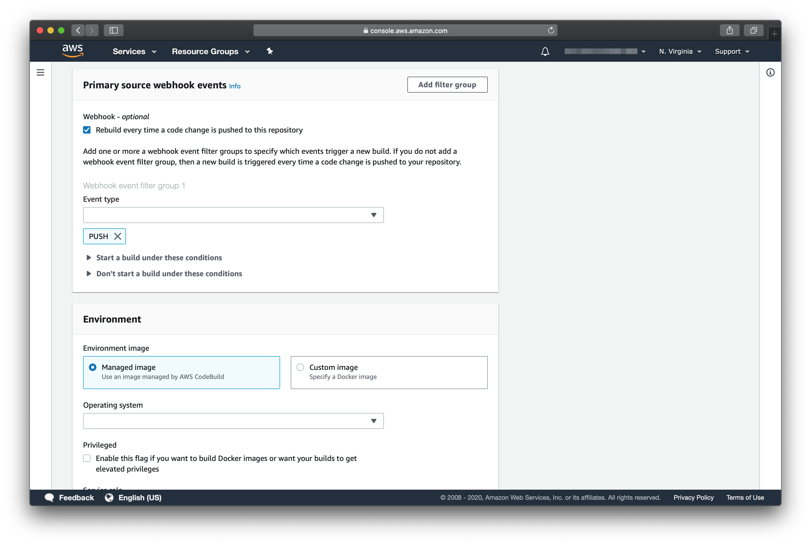
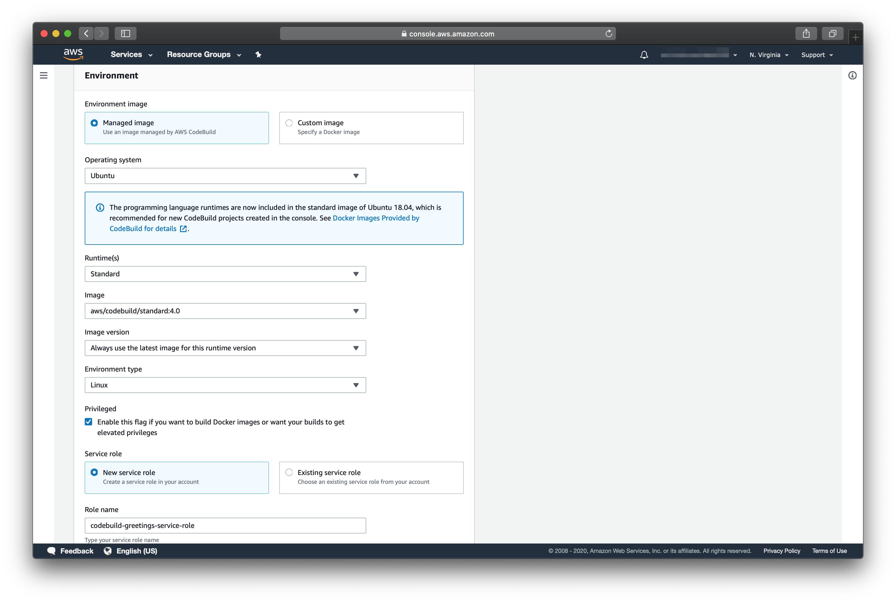
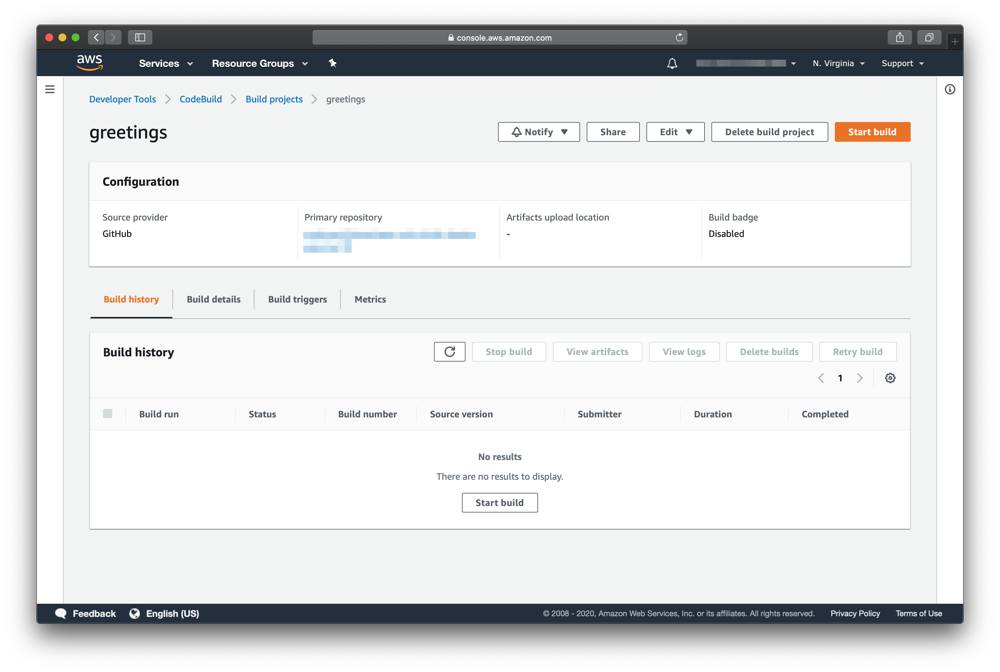

# AWS CODE BUILD
---

## OBJETIVO

Um guia visual prático, passo-a-passo, para construir uma imagem docker usando o [AWS Code Build](https://aws.amazon.com/codebuild/).

Esse guia assumirá que:
* Já existe um repository [AWS ECR](https://aws.amazon.com/ecr/) criado. Para mais informações sobre como criar um repositório [AWS ECR](https://aws.amazon.com/ecr/) acesse esse [guia](../ecr/README.md).
* Existe um arquivo [buildspec.yml](#BUILDSPEC) na raiz do projeto de código-fonte.


## CRIANDO O PROCESSO DE BUILD

1. Acesse o https://console.aws.amazon.com/ para fazer o login na [AWS](https://aws.amazon.com/).



2. Escolha a opção IAM user e preencha com suas informações de acesso (Account ID são 12 dígitos, o IAM user name é o e-mail e Password a senha).



3. Após o login você será redirecionado para AWS Management Console.



4. Para acessar o serviço [AWS Code Build](https://aws.amazon.com/codebuild/), clique em Services e digite CodeBuild na barra de pesquisa.



5. Na tela que surge, escolha a opção Create build project.



6. Avançando para o próximo passo, forneça as informações para criação do build project. Serão requeridos:

Project configuration:
* Project name: O nome do projeto. O nome escolhido servirá como base para criação das roles e policies.
* Description - optional: Uma descrição para esse build project.
* Build badge - optional: Uma badge que indica o status da última build.
* Additional configuration: tags para fácil identificação do projeto.



Source: 
* Source provider: O repositório de código-fonte do projeto. Nesse caso, escolhi [GitHub](https://github.com/). Existem outras opções, dentre as quais [Bitbucket](https://bitbucket.com/) e [AWS CodeCommit](https://aws.amazon.com/codecommit/). 
* Repository: Para escolha da opção Repository in my GitHub account, é necessário conectar sua conta [GitHub](https://github.com/) criando uma Personal access tokens. Siga esse [passo-a-passo](https://docs.aws.amazon.com/codepipeline/latest/userguide/GitHub-authentication.html) para isso.



Primary source webhook events:
* Webhook - optional: Opção para disparar a build após um push no repositório de código-fonte.
* Event Type: Tipo de evento gatilho para disparar a build.



Environment:
* Environment image: Existe a opção de escolher imagens de sistemas operacionais gerenciados pela [AWS Code Build](https://aws.amazon.com/codebuild/) ou usar uma imagem [Docker](https://docs.docker.com/) específica.
* Operating system: Caso escolha uma imagem gerenciada, a opção de sistema operacional aparecerá.
* Runtime: Dependendo da opção de sistema operacional, é possível escolher diferentes runtimes.
* Image: Imagem do sistema operacional.
* Image version: Versão da imagem.
* Environment type: Linux ou Linux GPU, dependendo da escolha do sistema operacional.
* Privileged: Marque essa opção para build de Docker Images.
*  Service role: Escolha a criação de uma nova role de serviço ou utilize uma já existente.
*  Role name: Indica o nome da nova role ou da role existente.



Buildspec, Artifacts e Logs não precisam ser alterados.

Clique em Create build project para seguir para o próxima tela.

7. Pronto! O build project foi criado e uma build pode ser dispara manualmente clicando em Start build.




## BUILDSPEC

O [Buildspec](https://docs.aws.amazon.com/codebuild/latest/userguide/build-spec-ref.html) é um arquivo no formato [YAML](https://yaml.org/) que deve estar versionado na raiz do projeto de código-fonte. Para esse guia, o arquivo abaixo foi utilizado. Observe as fases e as listas de comandos.

```yaml
version: 0.2

phases:
  install:
    runtime-versions:
      java: corretto8
  pre_build:
    commands:
      - echo Logging in to Amazon ECR...
      - $(aws ecr get-login --region $AWS_DEFAULT_REGION --no-include-email)
      - REPOSITORY_URI=248277115365.dkr.ecr.us-east-1.amazonaws.com
      - IMAGE_NAME=$REPOSITORY_URI/greetings
      - IMAGE_TAG=build-$(echo $CODEBUILD_BUILD_ID | awk -F":" '{print $2}')
  build:
    commands:
      - echo Build started on `date`
      - mvn -B package docker:build docker:push -Ddocker.registry=$REPOSITORY_URI
      - docker tag $IMAGE_NAME:latest $IMAGE_NAME:$IMAGE_TAG
      - docker push $IMAGE_NAME:$IMAGE_TAG
  post_build:
    commands:
      - printf '[{"name":"greetings","imageUri":"%s"}]' $IMAGE_NAME:$IMAGE_TAG > imagedefinitions.json
      - cat imagedefinitions.json
artifacts:
  files: imagedefinitions.json
```


### TO DO

* Como excluir o build project criado
