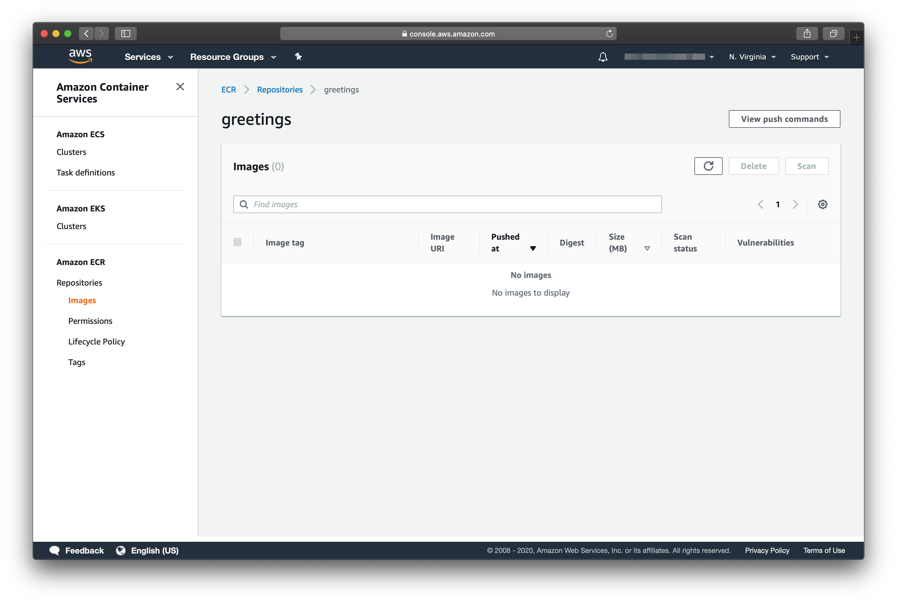

# AWS ECR
---

## OBJETIVO

Um guia visual prático, passo-a-passo, para criar um reposiório de imagens [Docker](https://docs.docker.com/) usando [ECR](https://aws.amazon.com/ecr/).

Esse guia não precisa de nenhum pré-requisito. 

## CRIANDO O REPOSITÓRIO

1. Acesse o https://console.aws.amazon.com/ para fazer o login na [AWS](https://aws.amazon.com/).

2. Escolha a opção IAM user e preencha com suas informações de acesso (Account ID são 12 dígitos, o IAM user name é o e-mail e Password a senha).

3. Após o login você será redirecionado para AWS Management Console.

4. Para acessar o serviço [ECR](https://aws.amazon.com/ecr/), clique em Services e digite ECR na barra de pesquisa.

5. Na tela que surge, escolha a opção Repositories sob Amazon ECR no menu lateral esquerdo.

6. Na tela seguinte, escolha a opção Create Repository

7. Nessa tela vamos configurar o nome do repository. Também é possível configurar esse repositório com a opção Tag immutability que restringe a substituição de imagens docker com a mesma tag (tipicamente a versão). Além disso, o serviço [ECR](https://aws.amazon.com/ecr/) oferece a opção Image scan settings para verificação de vulnerabilidades na imagem docker armazenada no repository. Clique em Create Repository para avançar.

8. Pronto! O Amazon Elastic Container Registry foi criado com sucesso. 

9. Clique no link do repository para mais informações.

10. Para visualizar os comandos de push/pull para esse repositório, clique em View Push Commands.

### TO DO

* Como apagar um repositório
