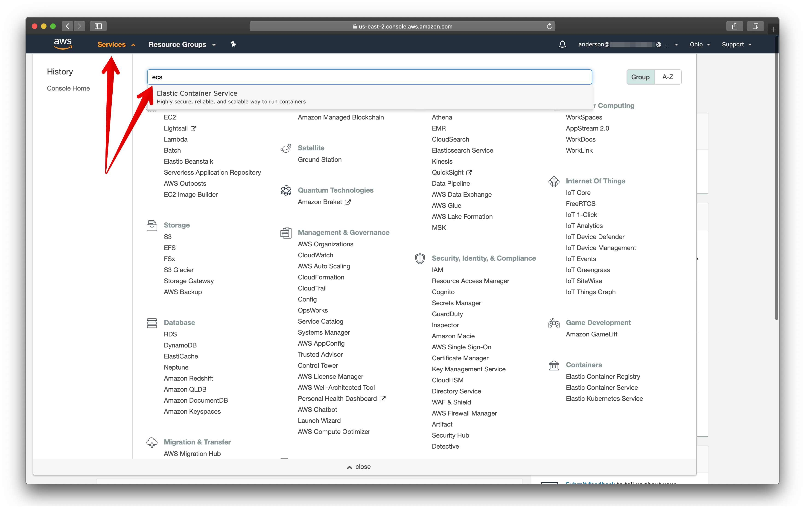

# AWS ECS
---

## OBJETIVO

Um guia visual prático, passo-a-passo, para construir um ambiente de execução de containers [Docker](https://docs.docker.com/) usando [ECS](https://aws.amazon.com/ecs/) e [EC2](https://aws.amazon.com/ec2/).

Esse guia assumirá que já existe uma [VPC](https://aws.amazon.com/vpc/), um [Security Group](https://docs.aws.amazon.com/vpc/latest/userguide/VPC_SecurityGroups.html) e uma [Subnet](https://docs.aws.amazon.com/vpc/latest/userguide/VPC_Subnets.html) para que o ambiente [ECS](https://aws.amazon.com/ecs/) possa, por exemplo, conectar num banco de dados [RDS](https://aws.amazon.com/rds/). 

## CRIANDO O AMBIENTE

1. Acesse o https://console.aws.amazon.com/ para fazer o login na [AWS](https://aws.amazon.com/).

2. Escolha a opção IAM user e preencha com suas informações de acesso (Account ID são 12 dígitos, o IAM user name é o e-mail e Password a senha).

3. Após o login você será redirecionado para AWS Management Console.

4. Para acessar o serviço [ECS](https://aws.amazon.com/ecs/), clique em Services e digite ECS na barra de pesquisa.

5. Na tela que surge, escolha a opção Clusters e em seguida Create Cluster.

6. No momento da criação de um cluster [ECS](https://aws.amazon.com/ecs/) é dada a opção de utilização do [AWS Fargate](https://aws.amazon.com/fargate/). Nesse guia, estamos focando na criação de um cluster [ECS](https://aws.amazon.com/ecs/) usando o [EC2](https://aws.amazon.com/ec2/), portanto a escolha a opção EC2 Linux + Networking.

7. Avançando para o próximo passo, forneça as informações para criação do cluster e clique em Create. Serão requeridos:
* Cluster name: O nome do cluster que será criado.
* Provisioning Model: A forma de provisionamento do cluster ECS. São duas opções: On-Demand Instance e Spot. [Entenda as diferenças dos modelos On-Demand Instance e Spot](https://docs.aws.amazon.com/AWSEC2/latest/UserGuide/using-spot-instances.html).
* EC2 instance type: O tamanho da instância que será utilizada pelo cluster. [Entenda sobre os tipos de instâncias EC2](https://aws.amazon.com/ec2/instance-types/).
* Number of instances: A quantidade de servidores do cluster.
* EC2 Ami Id: A imagem Amazon que rodará nos servidores do cluster. Por padrão a última versão da imagem é utilizada.
* Root EBS Volume Size (GiB): A quantidade de espaço em disco por servidor do cluster. O valor mínimo é 30 GiB.
* Key pair: A chave que pode ser utilizada para acessar os servidores do cluster.

Networking:
* VPC: Virtual private cloud que os servidores do cluster farão parte. Esse guia assume que já existe uma VPC criada e configurada.
* Subnet: Rede virtual que os servidores do cluster farão parte. Esse guia assume que já existe uma Subnet criada e configurada.
* Security group: O grupo de segurança os servidores do cluster farão parte. Esse guia assume que já existe um Security Group criado e configurado.

Container instance IAM role:
* Container instance IAM role: A role para execução de containers. Use aws-elasticbeanstalk-ec2-role.

Tags:
* Key: Uma chave para identificação da tag.
* Value: O valor da tag.

CloudWatch Container Insights:
* Enable Container Insights

8. Ao término da configuração, o console AWS apresentará as informações sobre o cluster [ECS](https://aws.amazon.com/ecs/). Clique em View Cluster.

9. Na tela de visualização do cluster você poderá criar os demais itens de configuração para finalização do deploy.

10. Clique em Task Definitions e escolha Create New Task Definition. Em seguida, escolha [EC2](https://aws.amazon.com/ec2/). 

11. Avançando para o próximo passo, forneça as informações para criação do Task Definition e clique em Create. Serão requeridos:

* Task Definition Name: O nome da Task Definition.
* Task Role: Escolha ecsTaskExecutionRole.
* Network Mode: As opções são: none, bridge, awsvpc e host. Escolha Bridge para permitir acesso externo ao container disponibilizado. [Entenda um pouco mais sobre as diferenças entre as opções Network Mode](https://docs.aws.amazon.com/AmazonECS/latest/developerguide/task_definition_parameters.html).

Task execution IAM role:
* Task execution role: Escolha ecsTaskExecutionRole

Task size:
* Task memory (MiB): Configuração de memória utilizada no seu container. Essa configuração depende do EC2 instance type escolhido. [Entenda sobre os tipos de instâncias EC2](https://aws.amazon.com/ec2/instance-types/). Nesse guia, usaremos 512.
* Task CPU (unit): Configuração de CPU utilizada no seu container. Essa configuração depende do EC2 instance type escolhido. [Entenda sobre os tipos de instâncias EC2](https://aws.amazon.com/ec2/instance-types/). Nesse guia, usaremos 256.

Container Definitions: Ao clicar no botão Add Container, informe:

Container name: O nome do container. 
Image: O nome completo, incluindo o Docker Registry, da imagem docker. Exemplo: openjdk:15-slim-buster ou 968377522215.dkr.ecr.us-east-2.amazonaws.com/service:latest
Port Mapping: Adicione a porta do container que deverá ser exposta para o host. Nesse guia, usamos a 8080 e para o host mantivemos a porta 8080.

* Log Configuration: Auto-configure CloudWatch Logs. Clique em Add or Update.

12. O passo final é criar uma Service com base na Task Definition criada. Para isso, clique em Actions e escolha a opção Create Service.

13. Avançando para o próximo passo, forneça as informações para criação do Service e clique em Create. Serão requeridos:

* Service name: O nome do serviço.
* Number of Tasks: 1

14. Para efeitos práticos, o serviço foi criado e disponibilizado. Para verificar se tudo está ok, acesse Clusters, Tasks e clique na task running:

### TO DO

* Como apagar o ambiente criado
* Adicionar informações para health check
* Incluir réplicas e auto scale
